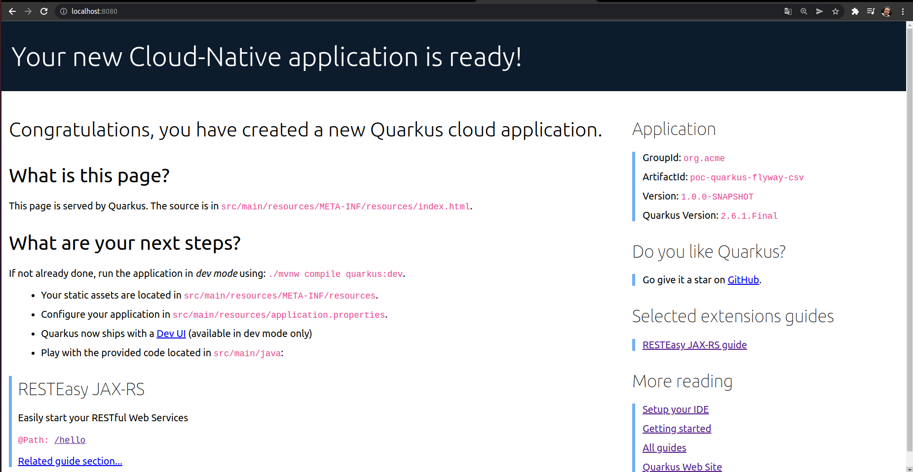
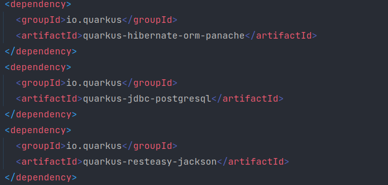
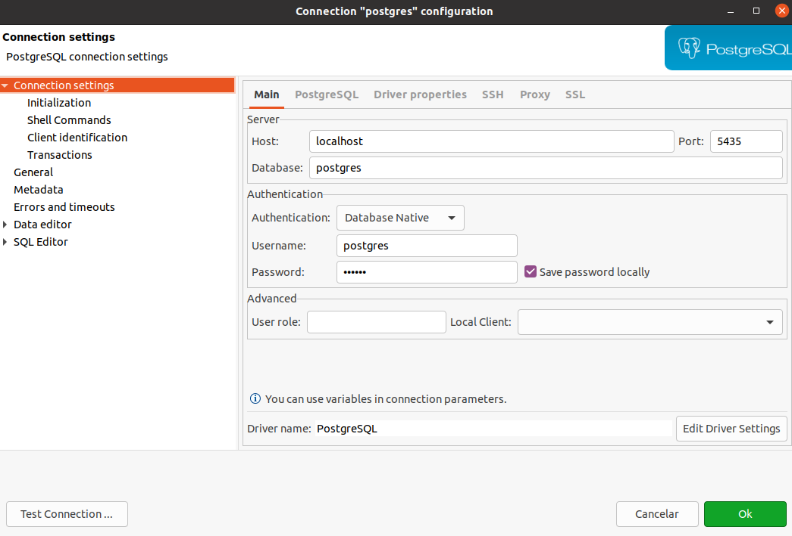
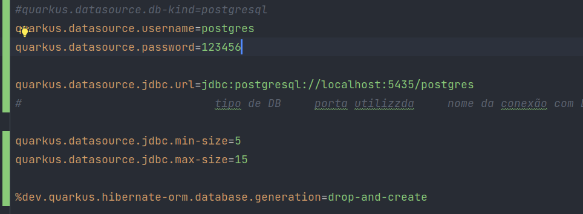
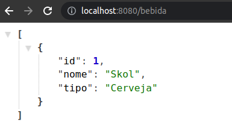
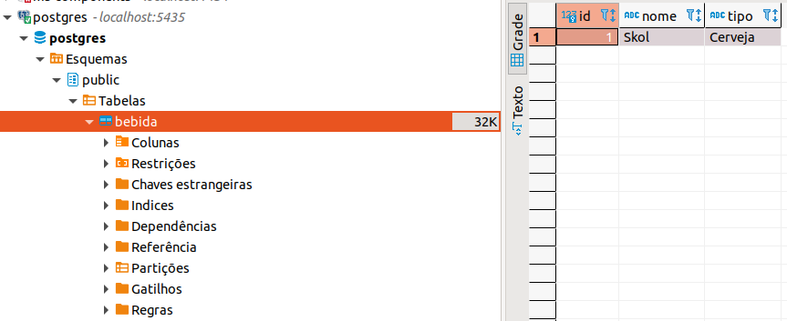

# Project

##poc-quarkus-flyway-csv  

#### Projeto trata-se de:
    -Criar uma POC para avaliar se o quarkus + flyway permiti importação de CSV.

## Rodando a aplicação em modo dev

Você pode executar o seu arquivo noi modo dev que permite a codificação ao vivo usando:
```shell script
./mvnw compile quarkus:dev
```

> **_NOTE:_**  O Quarkus agora vem com uma UI Dev, que está disponível no modo dev apenas em http://localhost:8080/q/dev/.

## Configurações do projeto

#### Para iniciar o projeto, utilizaremos extenções e documentações do site: https://quarkus.io/

No quarkus.io determinamos o nome do projeto e quais as extenções iniciais queremos inicializar.  
Neste projeto não vamos começar com nenhuma. Adicionaremos em seguida as extensões necessárias.  
Após a configuração do projeto no quarkus.io, baixamos o ZIP e colocamos no diretório escolhido.  
E com o comando **./mvnw compile quarkus:dev** rodamos a aplicaçãop em nosso **localhost:8080**.  

  

E com o comando **http://localhost:8080/hello** temos acesso a nosso primeiro endPoint.  
que esta em __src/main/java/org.acme/GreetingResource.java__.  

# Extensões e configurações

https://quarkus.io/guides/all-config :
    esta página lista todas as configurações de todas as extensões  


    ./mvnw quarkus:list-extensions
Este comando, lista todas as extensões  

    ./mvnw quarkus:add-extension -Dextensions="nome da extensão"    
Este comando, adciona uma nova extensão  

Podemos verificar todas as nossas estensões no arquivo ***pom.xml***  



Para continuação de nosso projeto vamos precisar subir uma imagem docker de Postgres:  

    docker run -d -i -t -p5435:5432 -ePOSTGRES_PASSWORD=123456 postgres:13  

Abrimos o DBeaver para realizar a conexão:

  

-hots = localhost  
-porta = 5435  
-database = postgres  
-username = postgres  
-senha = 123456  

###Configurando o ***application.properties***  

Localize o arquivo ***application.properties*** e configure da seguinte maneira para conexão com o DB  

  

# Realizando o CRUD  

Criamos a entidade ***Bebida*** e as configurações de ***BebidaResource***  
Fazemos uma chamada no ***Postman*** em ***localhost:8080/bebida***  

  

E em seguida podemos notar que nossa tabela **bebida** foi criada em nosso DB e a bebida Skol foi cadastrada na tabela.  


